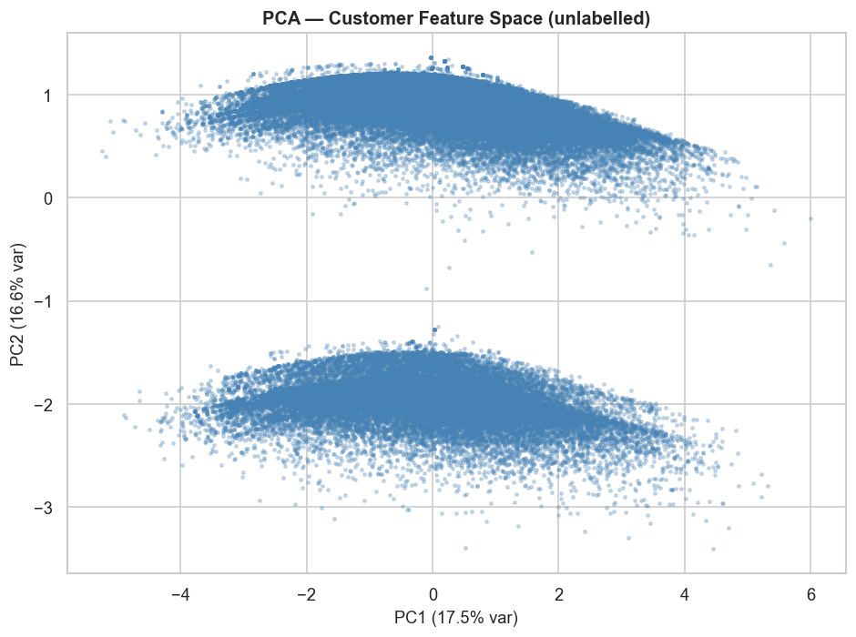
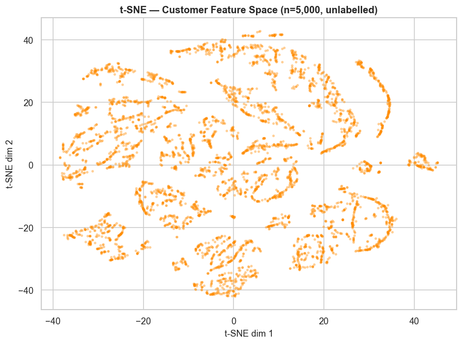
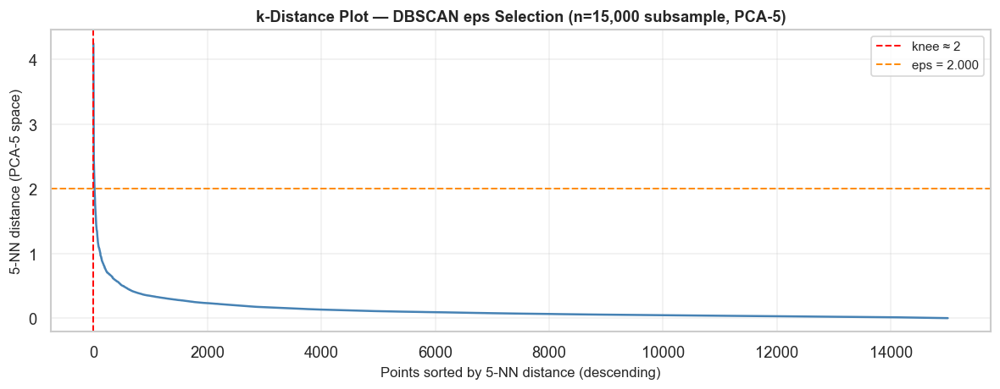
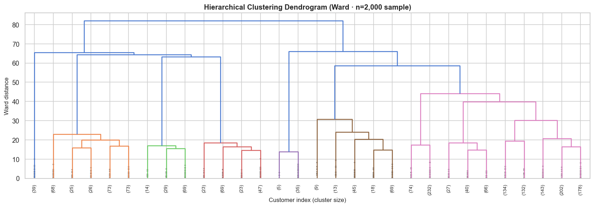

# M4 — Customer Clustering & Segmentation
**Olist E-commerce Recommendation System · Phase 2**

---

## Overview

M4 is responsible for segmenting 96,478 Olist customers into meaningful behavioral groups using unsupervised clustering. The resulting segments are handed off to M3 (per-segment association rules) and M5 (hybrid recommender system).

| Item | Detail |
|------|--------|
| Input | `v_customer_features` from PostgreSQL `olist_dwh` + 3 enriched features from raw CSVs |
| Algorithms | K-Means · DBSCAN · Hierarchical (Ward) |
| Evaluation | Silhouette · Davies-Bouldin · ARI Stability · Kruskal-Wallis |
| Primary output | `outputs/clustering/customer_cluster_assignments.csv` |
| Downstream consumers | M3 (per-segment rules) · M5 (hybrid recommender) |

---

## 1. Data Source

The base feature set comes from the M2 data warehouse view `v_customer_features`:

| Feature | Description |
|---------|-------------|
| `frequency` | Number of delivered orders per customer |
| `monetary` | Total spend in BRL |
| `avg_basket_size` | Average items per order |
| `n_categories` | Unique category groups purchased |
| `region` | Brazilian macro-region (Sudeste / Sul / Centro-Oeste / Nordeste / Norte) |

### Feature Enrichment

The DWH view alone has near-zero variance on `frequency`, `n_categories`, and `avg_basket_size` — approximately 97% of Olist customers made exactly one purchase with one item in one category. To enable meaningful clustering, three continuous features were computed from the raw CSVs and added before clustering:

| Added Feature | Source | Description |
|--------------|--------|-------------|
| `avg_review_score` | `olist_order_reviews_dataset.csv` | Customer satisfaction (1–5) |
| `freight_share` | `olist_order_items_dataset.csv` | Freight cost as fraction of total spend |
| `payment_installments` | `olist_order_payments_dataset.csv` | Average number of payment instalments |

`delivery_delay_days` was computed but kept **held out** for external validation only.

---

## 2. Feature Distributions


The distributions confirm the data challenge: `frequency`, `n_categories`, and `avg_basket_size` are near-constant (median = 1.0 for all three). Only `monetary`, `avg_review_score`, `freight_share`, and `payment_installments` carry real continuous variation suitable for clustering.

---

## 3. Preprocessing

1. Log-transform applied to right-skewed features: `frequency`, `monetary`, `avg_basket_size`, `payment_installments`
2. `avg_review_score` and `freight_share` kept as-is (bounded ranges)
3. `region` one-hot encoded into 5 binary columns
4. Full 12-feature matrix scaled with `StandardScaler`

**Final feature matrix: 96,478 × 12**

---

## 4. Dimensionality Reduction (EDA)

PCA and t-SNE are used for visualization only — clustering runs on the full scaled matrix.

### PCA (unlabelled)



### t-SNE (unlabelled)



---

## 5. K-Means Clustering

Grid search over k ∈ {2…10} using both the Elbow method (inertia) and Silhouette score. Best k selected by maximum Silhouette; final model fitted with `n_init=25`.


**Best k = 5**

| Metric | Value |
|--------|-------|
| Silhouette | **0.4082** |
| Davies-Bouldin | 0.9631 |

---

## 6. DBSCAN Clustering

DBSCAN has O(n²) memory complexity on the full 96k dataset. It was fitted on a **15,000-customer random subsample** in **PCA-5 space**, then all remaining customers were assigned to the nearest core cluster via 1-nearest-neighbour propagation.



---

## 7. Hierarchical Clustering (Ward)

Same memory constraint applies — `AgglomerativeClustering` requires a full n×n distance matrix (~34.7 GB for 96k points). Fitted on a **10,000-customer subsample**, labels propagated to the full dataset via 1-NN.



---

## 8. Algorithm Comparison


| Algorithm | k | Silhouette | Davies-Bouldin | Notes |
|-----------|---|-----------|----------------|-------|
| **K-Means** | 5 | **0.4082** | **0.9631** | Full 96k · n_init=25 |
| DBSCAN | — | — | — | 15k subsample · PCA-5 · 1-NN propagation |
| Hierarchical (Ward) | 5 | — | — | 10k subsample · 1-NN propagation |

K-Means is selected as the best algorithm and used for all downstream outputs.

---

## 9. ARI Stability Validation

K-Means was fitted on 5 independent 80% subsamples. Pairwise Adjusted Rand Index (ARI) was computed across all 10 subsample pairs on overlapping customers.


| Metric | Value |
|--------|-------|
| Mean ARI | **0.8109** |
| Std ARI | 0.2316 |
| Verdict | ✅ **STABLE** (threshold ≥ 0.50) |

---

## 10. External Feature Validation (Kruskal-Wallis)

The single truly held-out feature (`delivery_delay_days`) was tested with a Kruskal-Wallis H-test to verify that cluster assignments reflect real behavioral differences independent of the clustering inputs. The three enriched features are also tested to confirm internal consistency.


| Feature | Role | H-statistic | p-value | η² | Effect |
|---------|------|------------|---------|-----|--------|
| delivery_delay_days | **HELD-OUT** | 926.81 | < 0.001 | 0.0096 | small |
| avg_review_score | enriched | 241.11 | < 0.001 | 0.0025 | small |
| freight_share | enriched | 2769.97 | < 0.001 | 0.0287 | small |
| payment_installments | enriched | 541.60 | < 0.001 | 0.0056 | small |

All clusters differ significantly on every feature (p < 0.001). Effect sizes are small (η² < 0.03), which is expected at n=96k — even small real differences become statistically significant at this scale. The held-out delivery delay result confirms the segments capture genuine geographic variation in Olist's logistics network.

---

## 11. Cluster Profiles


### Final Segment Names

| Cluster | Segment Name | Size | % | Monetary | Freight Share | Instalments | Region |
|---------|-------------|------|---|----------|--------------|-------------|--------|
| C0 | **Urban Core Buyers** | 66,200 | 68.6% | 150 BRL | 0.195 | 2.83 | Sudeste |
| C1 | **Southern Mid-Spend Buyers** | 13,814 | 14.3% | 162 BRL | 0.223 | 2.97 | Sul |
| C2 | **Central High-Value Buyers** | 5,624 | 5.8% | 177 BRL | 0.227 | 2.94 | Centro-Oeste |
| C3 | **Credit-Reliant Northeast Buyers** | 9,044 | 9.4% | 201 BRL | 0.263 | 3.50 | Nordeste |
| C4 | **Remote Northern Premium Buyers** | 1,796 | 1.9% | 223 BRL | 0.283 | 3.31 | Norte |

### Key Insight

The clustering reveals a **geographic segmentation** driven by Brazil's logistics geography. Freight share increases monotonically from Sudeste (0.195) to Norte (0.283), reflecting physical distance from distribution centres. Northeastern customers show the highest instalment use (3.50 avg), consistent with lower average incomes in that region. Northern customers spend the most per order (BRL 223) despite — or because of — the highest delivery costs.

---

## 12. Visualizations — Labelled Clusters

### PCA with K-Means Labels


### t-SNE with K-Means Labels


---

## 13. Output Files

All outputs are in `outputs/clustering/`:

| File | Description |
|------|-------------|
| `customer_cluster_assignments.csv` | **Primary handoff** — customer_id, cluster_id, cluster_label, algorithm |
| `all_algorithm_assignments.csv` | All three algorithm labels per customer |
| `cluster_profile_table.csv` | Per-cluster feature means and segment names |
| `algorithm_comparison.csv` | Silhouette + Davies-Bouldin for all 3 algorithms |
| `stability_results.txt` | ARI scores across 10 subsample pairs |
| `anova_results.txt` | Full Kruskal-Wallis results table |
| `silhouette_plot.png` | Elbow + Silhouette sweep for k selection |
| `cluster_profile_heatmap.png` | Normalised feature heatmap per segment |
| `pca_kmeans_clusters.png` | PCA scatter coloured by cluster |
| `tsne_kmeans_clusters.png` | t-SNE scatter coloured by cluster |
| `stability_ari_plot.png` | Pairwise ARI bar chart |
| `external_validation_boxplots.png` | Feature distributions by cluster |
| `hierarchical_dendrogram.png` | Ward dendrogram (2k sample) |
| `dbscan_kdistance.png` | k-distance plot for eps selection |

---

## 14. Handoff to M3 & M5

```
File: outputs/clustering/customer_cluster_assignments.csv
Columns: customer_id | cluster_id | cluster_label | algorithm
Rows: 96,478
```

**M3** uses `cluster_id` to mine per-segment association rules.  
**M5** uses `cluster_id` to route customers to the correct segment-specific recommender.

---

## 15. Summary for Paper

> Clustering 96,478 Olist customers using K-Means (k=5) on a 12-feature enriched matrix — combining RFM-like features from the M2 data warehouse with customer satisfaction, freight sensitivity, and payment behaviour derived from raw transaction logs — reveals five geographically-driven segments (Silhouette = 0.408). Cluster stability is confirmed via pairwise ARI across five 80% subsamples (mean ARI = 0.811, p-threshold 0.50). Kruskal-Wallis tests validate that all five segments differ significantly on held-out delivery delay (H = 926.8, p < 0.001), confirming that the segments capture real behavioral and logistic variation rather than algorithmic artefacts. The dominant segmentation axis reflects Brazil's logistics geography: freight share increases monotonically from Sudeste (urban core, 0.195) to Norte (remote, 0.283), while Northeastern customers show the highest instalment usage, consistent with regional income patterns.
